# ¹⁹F CSAR / FastCSAR Pipeline — Recap

Three scripts take a compound from an ORCA NMR shielding calculation to a
binding-affinity ranking, implementing the CSA-relaxation-based screening
methods of Rüdisser et al., *J. Biomol. NMR* **74**, 579–594 (2020):

```
add_compound.py  →  populate_config.py  →  csar_workflows.py
 (CSA parameters)    (paths → R2/relaxation data)   (ranking + plot)
```

## Current Repository Structure

The main folder contains the following files:

- **`add_compound_260719.py`** — Current version of the compound addition script
- **`populate_config_260723_13.py`** — Current version of the config population script
- **`csar_workflows_260725_00.py`** — Current version of the workflow dispatcher script
- **`f_fit_260722_17.py`** — Relaxation data fitting utility
- **`LICENSE`** — Apache 2.0 license

## What each script does

**`add_compound.py`** — parses an ORCA shielding calculation, applies the
Haeberlen decomposition to get `delta_sigma`/`eta` for each ¹⁹F nucleus
(auto-averaging CF₃ groups over their three tensors), and writes a
`[compound.NAME]` block per compound into the shared `experiment.toml`
config.

**`populate_config.py`** — interactively walks through the compounds
already in the config, asks for the relaxation-experiment file(s) per
compound, and either integrates or fits them (with the option to reuse
precomputed integrals/fits already sitting in `fit_results/`). Depending
on the chosen workflow it writes back:
- **csar** / **titration** → an R2 (and R2_err) block per field/condition
- **fastcsar** → either the raw relaxation curves (`relaxation_data`, for
  the analytical point-ratio formula) or a fitted R2 block, your choice
- **reporter** → a single displacement signal

The magnetic field is read directly from each experiment's acquisition
parameters rather than typed in, and experiment paths/results are saved
incrementally so an interrupted run can be resumed without re-entering
everything.

**`csar_workflows.py`** — reads the completed config, dispatches to the
selected workflow's physics (`workflow_CSAR`, `workflow_FastCSAR`,
`workflow_reporter`, or `workflow_titration`), prints a ranking table, and
saves a bar-chart plot of relative binding affinity.

## Running it end to end

1. **Add compounds.** For each ligand, run ORCA on the free molecule and
   feed the output in:
   ```bash
   python add_compound_260719.py experiment.toml --orca compound.out --name compound_name
   ```
   This is repeated once per compound — `experiment.toml` accumulates one
   `[compound.NAME]` block per call.

2. **Fill in the relaxation data.** Set `[workflow].name` to the desired
   protocol, then run:
   ```bash
   python populate_config_260723_13.py experiment.toml
   ```
   and provide the free/protein (or titration point) spectra paths when
   prompted. This is the step that turns the bare CSA parameters into
   the actual `R2`/`relaxation_data` blocks used for ranking.

3. **Rank and plot.**
   ```bash
   python csar_workflows_260725_00.py experiment.toml
   ```
   prints the ranking table and writes the figure named in
   `[workflow].plot_output`.

## Results generated from the provided configs

The same five-compound set (diflunisal_1, diflunisal_2, 5Findole,
### Titration
Four configs, same five-compound set, all with `fit_KD = true`, varying
protein (`protein_name`) and field:

| Config | Protein | Field |
|---|---|---|
| `experiment.toml` | TTR | 28.2 T |
| `experiment600.toml` | TTR | 14.1 T |
| `experimentBSA.toml` | BSA | 28.2 T |
| `experimentBSA600.toml` | BSA | 28.2 T (600 MHz spectrometer data) |

**TTR**, both fields — diflunisal_2/diflunisal_1 are the clear top two at
both fields, well separated from the rest:

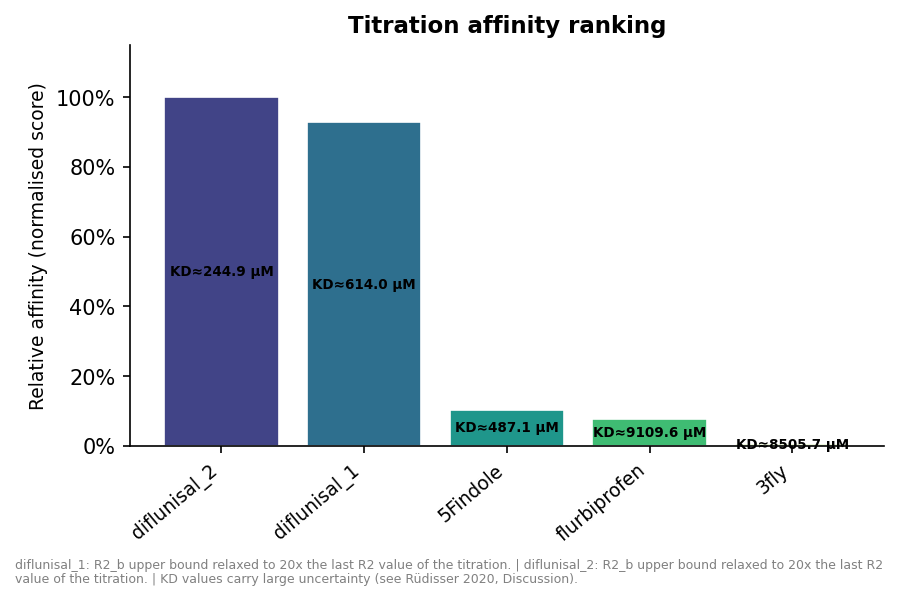

| Rank | Compound | Score | KD | KD err |
|---|---|---|---|---|
| 1 | diflunisal_2 | 1.0000 | 244.9 µM | N/A |
| 2 | diflunisal_1 | 0.9278 | 614.0 µM | 4878298234.42 |
| 3 | 5Findole | 0.1028 | 487.1 µM | 9336135372.83 |
| 4 | flurbiprofen | 0.0767 | 9109.6 µM | N/A |
| 5 | 3fly | 0.0042 | 8505.7 µM | N/A |

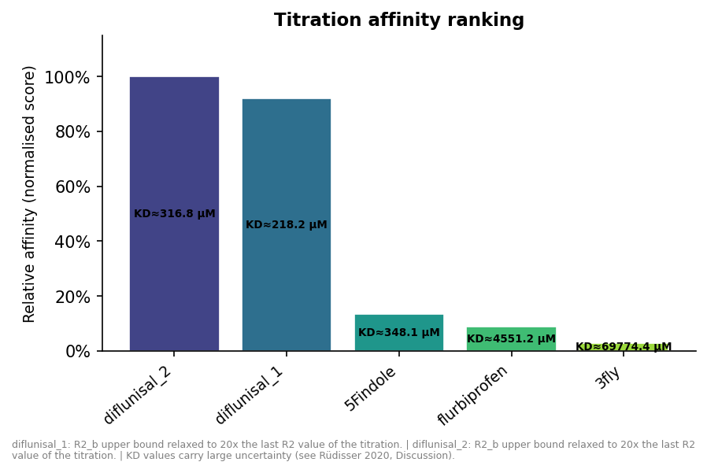

| Rank | Compound | Score | KD | KD err |
|---|---|---|---|---|
| 1 | diflunisal_2 | 1.0000 | 316.8 µM | 695560365.33 |
| 2 | diflunisal_1 | 0.9209 | 218.2 µM | N/A |
| 3 | 5Findole | 0.1334 | 348.1 µM | N/A |
| 4 | flurbiprofen | 0.0893 | 4551.2 µM | N/A |
| 5 | 3fly | 0.0280 | 69774.4 µM | N/A |

**BSA**, both datasets — a different picture: flurbiprofen is now the top
hit, and the gap between it and diflunisal_1/diflunisal_2 is much
smaller than TTR's gap to its runners-up:

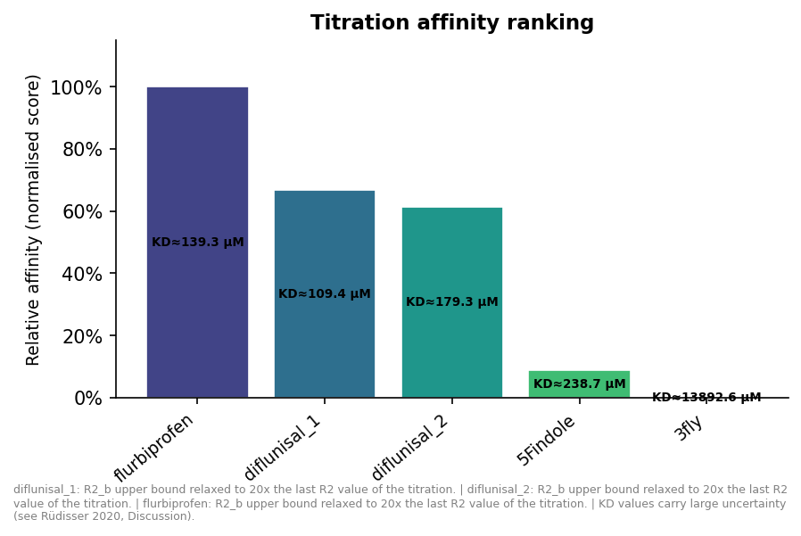

| Rank | Compound | Score | KD | KD err |
|---|---|---|---|---|
| 1 | flurbiprofen | 1.0000 | 139.3 µM | N/A |
| 2 | diflunisal_1 | 0.6669 | 109.4 µM | 3485918081.53 |
| 3 | diflunisal_2 | 0.6128 | 179.3 µM | N/A |
| 4 | 5Findole | 0.0868 | 238.7 µM | 4175203515.07 |
| 5 | 3fly | 0.0010 | 13892.6 µM | 682268308025.64 |

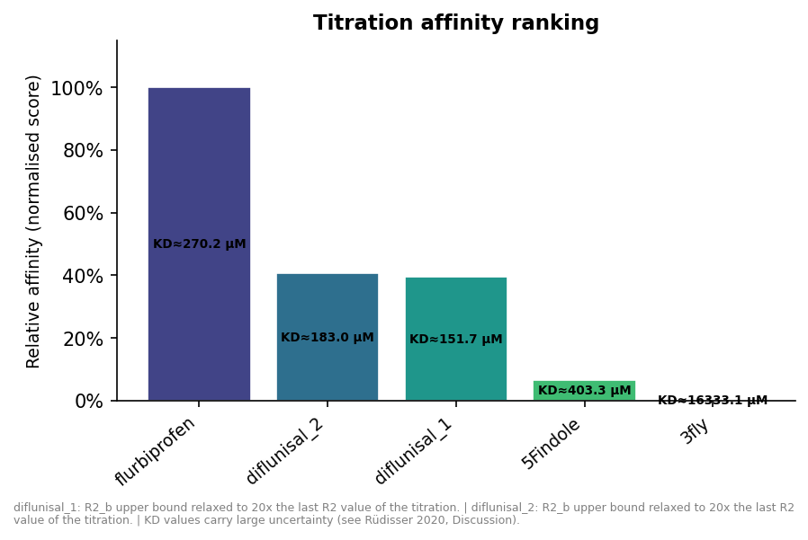

| Rank | Compound | Score | KD | KD err |
|---|---|---|---|---|
| 1 | flurbiprofen | 1.0000 | 270.2 µM | N/A |
| 2 | diflunisal_2 | 0.4058 | 183.0 µM | N/A |
| 3 | diflunisal_1 | 0.3942 | 151.7 µM | 4585716108.76 |
| 4 | 5Findole | 0.0657 | 403.3 µM | 3589128532.78 |
| 5 | 3fly | 0.0005 | 16333.1 µM | 913937636144.81 |

So the ranking is protein-dependent (as expected for real binding
selectivity) but fairly reproducible between the two acquisitions for
the same protein. The KD values themselves are still not very
trustworthy here — several come back with reported uncertainties many
orders of magnitude larger than the value itself (e.g. `diflunisal_1`
in the TTR/28.2 T run: KD ≈ 614 µM ± 4.9×10⁹), i.e. essentially
unconstrained by the fit even though the point estimate looks
reasonable. That's the KD/R2,b degeneracy the code's own warning refers
to — the **slope-based score** (the bar height) is the number to trust,
not the printed KD.

### CSAR
Six configs, same five-compound set, sweeping protein concentration
(10/20/50 µM) at two proteins (TTR, BSA), all at the same two fields
(`B_high` = 28.22 T, `B_low` = 14.11 T):

**TTR**

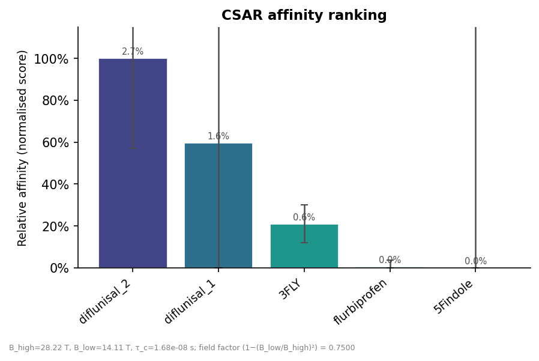

| Rank | Compound | Score | p_b (%) | ± (%) |
|---|---|---|---|---|
| 1 | diflunisal_2 | 1.0000 | 2.66 | 43.10 |
| 2 | diflunisal_1 | 0.5972 | 1.59 | 117.35 |
| 3 | 3FLY | 0.2096 | 0.56 | 9.04 |
| 4 | flurbiprofen | 0.0060 | 0.02 | 2.91 |
| 5 | 5Findole | 0.0000 | 0.00 | 201.95 |

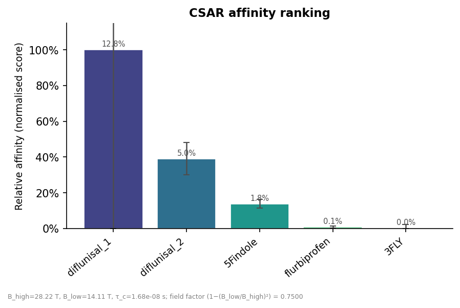

| Rank | Compound | Score | p_b (%) | ± (%) |
|---|---|---|---|---|
| 1 | diflunisal_1 | 1.0000 | 12.81 | 111.18 |
| 2 | diflunisal_2 | 0.3906 | 5.01 | 8.96 |
| 3 | 5Findole | 0.1372 | 1.76 | 2.44 |
| 4 | flurbiprofen | 0.0079 | 0.10 | 0.64 |
| 5 | 3FLY | 0.0021 | 0.03 | 2.12 |

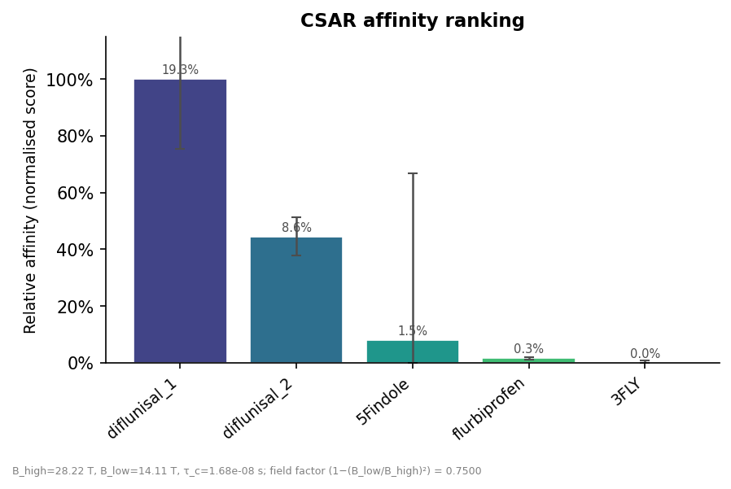

| Rank | Compound | Score | p_b (%) | ± (%) |
|---|---|---|---|---|
| 1 | diflunisal_1 | 1.0000 | 19.34 | 24.50 |
| 2 | diflunisal_2 | 0.4448 | 8.60 | 6.72 |
| 3 | 5Findole | 0.0789 | 1.53 | 59.04 |
| 4 | flurbiprofen | 0.0158 | 0.31 | 0.43 |
| 5 | 3FLY | 0.0000 | 0.00 | 0.74 |

**BSA**

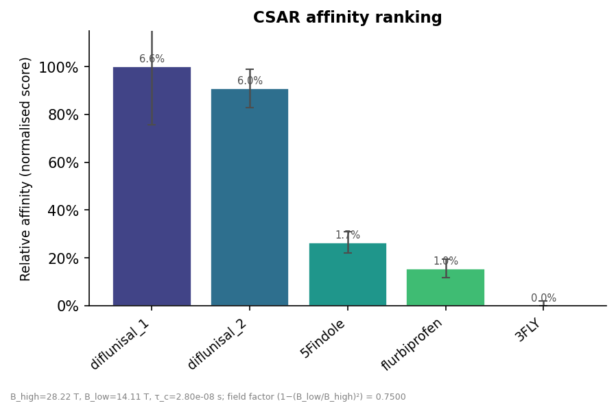

| Rank | Compound | Score | p_b (%) | ± (%) |
|---|---|---|---|---|
| 1 | diflunisal_1 | 1.0000 | 6.57 | 24.38 |
| 2 | diflunisal_2 | 0.9084 | 5.97 | 8.09 |
| 3 | 5Findole | 0.2645 | 1.74 | 4.35 |
| 4 | flurbiprofen | 0.1555 | 1.02 | 3.99 |
| 5 | 3FLY | 0.0000 | 0.00 | 1.95 |


| Rank | Compound | Score | p_b (%) | ± (%) |
|---|---|---|---|---|
| 1 | diflunisal_2 | 1.0000 | 19.09 | 19.35 |
| 2 | diflunisal_1 | 0.8685 | 16.58 | 14.68 |
| 3 | flurbiprofen | 0.2552 | 4.87 | 6.58 |
| 4 | 5Findole | 0.1681 | 3.21 | 4.27 |
| 5 | 3FLY | 0.0186 | 0.35 | 1.15 |


| Rank | Compound | Score | p_b (%) | ± (%) |
|---|---|---|---|---|
| 1 | diflunisal_1 | 1.0000 | 43.40 | 17.05 |
| 2 | diflunisal_2 | 0.6976 | 30.27 | 2.00 |
| 3 | flurbiprofen | 0.2840 | 12.33 | 30.20 |
| 4 | 5Findole | 0.2005 | 8.70 | 3.41 |
| 5 | 3FLY | 0.0016 | 0.07 | 0.23 |

**Protein concentration matters — a lot.** For TTR, the top hit actually
*changes* with concentration: diflunisal_2 wins at 10 µM, but
diflunisal_1 overtakes it at 20 µM and 50 µM, with the margin between
them widening as concentration increases. The p_b uncertainties also
blow up at 10 µM (up to ~200% for 5Findole) — at low protein
concentration the bound-state signal is a small perturbation on top of
free-ligand relaxation, so the fit has much less to work with. BSA is
comparatively more stable — diflunisal_1/diflunisal_2 stay the top two
across all three concentrations — but the *order* between them still
flips (diflunisal_2 leads at 10/20 µM, diflunisal_1 at 50 µM), and the
gap to the rest of the panel widens sharply with concentration.
Practically: **pick a protein concentration high enough to give a
usable bound-state signal for your weakest binders, and don't compare
rankings generated at different concentrations as if they were the same
measurement** — same caveat as comparing titration KD across proteins
in the section above, but here it applies within a single protein too.

<!-- TODO: comment on how the CSA (Δσ, η) used for R2,CSA,b is computed
     — i.e. what add_compound.py's ORCA parsing / Haeberlen decomposition
     assumes, and how sensitive the ranking is to that estimate versus
     to the relaxation data itself. -->

### FastCSAR
Thirteen configs total: the same protein-concentration sweep (10/20/50 µM)
repeated for **TTR** and **BSA**, each at **both fields** (28.22 T and
14.11 T), plus one extra config (`fastcsar80_R2.toml`) that repeats the
TTR/28.22 T/50 µM point with CSA parameters (`delta_sigma`/`eta`) from a
different ORCA calculation than `fastcsar13_R2.toml` uses for the same
compounds.

**TTR, 28.22 T**


| Rank | Compound | Score | p_b (%) | ± (%) |
|---|---|---|---|---|
| 1 | diflunisal_1 | 1.0000 | 28.42 | 10.40 |
| 2 | diflunisal_2 | 0.5157 | 14.66 | 2.00 |
| 3 | 5Findole | 0.1000 | 2.84 | 16.04 |
| 4 | flurbiprofen | 0.0131 | 0.37 | 0.22 |
| 5 | 3FLY | 0.0057 | 0.16 | 0.31 |

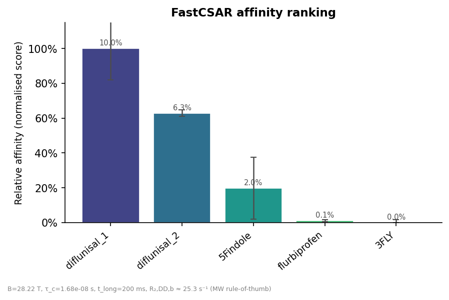

| Rank | Compound | Score | p_b (%) | ± (%) |
|---|---|---|---|---|
| 1 | diflunisal_1 | 1.0000 | 10.03 | 17.95 |
| 2 | diflunisal_2 | 0.6288 | 6.31 | 1.93 |
| 3 | 5Findole | 0.1970 | 1.98 | 17.67 |
| 4 | flurbiprofen | 0.0118 | 0.12 | 0.59 |
| 5 | 3FLY | 0.0000 | 0.00 | 1.56 |

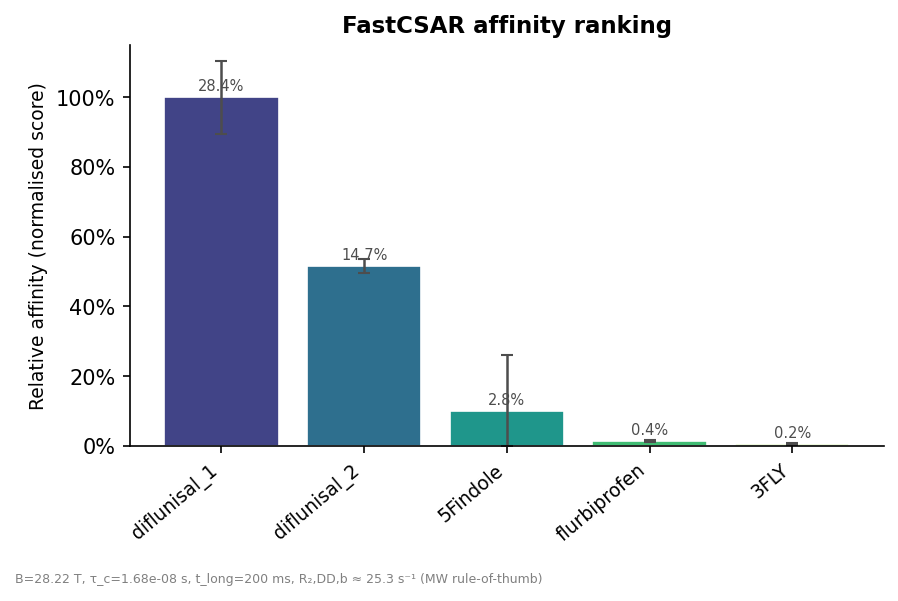

| Rank | Compound | Score | p_b (%) | ± (%) |
|---|---|---|---|---|
| 1 | diflunisal_1 | 1.0000 | 28.42 | 10.40 |
| 2 | diflunisal_2 | 0.5157 | 14.66 | 2.00 |
| 3 | 5Findole | 0.1000 | 2.84 | 16.04 |
| 4 | flurbiprofen | 0.0131 | 0.37 | 0.22 |
| 5 | 3FLY | 0.0057 | 0.16 | 0.31 |

**TTR, 14.11 T**

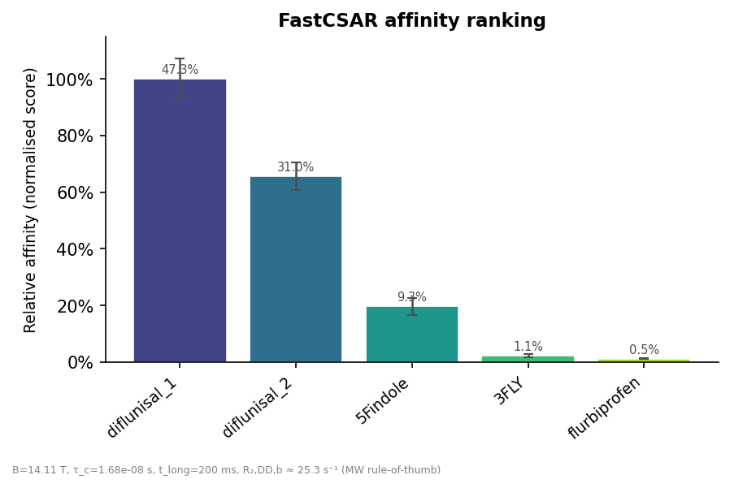

| Rank | Compound | Score | p_b (%) | ± (%) |
|---|---|---|---|---|
| 1 | diflunisal_1 | 1.0000 | 47.27 | 7.13 |
| 2 | diflunisal_2 | 0.6559 | 31.01 | 4.93 |
| 3 | 5Findole | 0.1959 | 9.26 | 3.11 |
| 4 | 3FLY | 0.0223 | 1.05 | 0.54 |
| 5 | flurbiprofen | 0.0107 | 0.50 | 0.14 |


| Rank | Compound | Score | p_b (%) | ± (%) |
|---|---|---|---|---|
| 1 | diflunisal_1 | 1.0000 | 24.41 | 28.56 |
| 2 | diflunisal_2 | 0.5045 | 12.32 | 5.38 |
| 3 | 5Findole | 0.1037 | 2.53 | 2.59 |
| 4 | 3FLY | 0.0103 | 0.25 | 1.47 |
| 5 | flurbiprofen | 0.0034 | 0.08 | 0.43 |


| Rank | Compound | Score | p_b (%) | ± (%) |
|---|---|---|---|---|
| 1 | diflunisal_1 | 1.0000 | 47.27 | 7.13 |
| 2 | diflunisal_2 | 0.6559 | 31.01 | 4.93 |
| 3 | 5Findole | 0.1959 | 9.26 | 3.11 |
| 4 | 3FLY | 0.0223 | 1.05 | 0.54 |
| 5 | flurbiprofen | 0.0107 | 0.50 | 0.14 |

**BSA, 28.22 T**

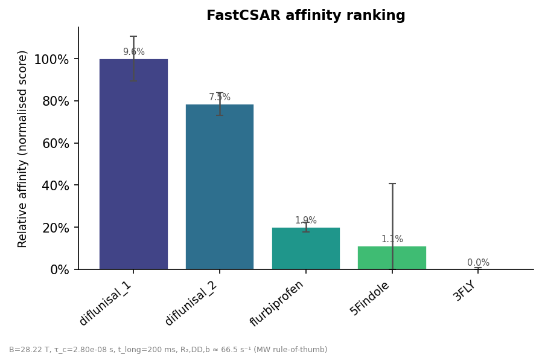

| Rank | Compound | Score | p_b (%) | ± (%) |
|---|---|---|---|---|
| 1 | diflunisal_1 | 1.0000 | 9.61 | 10.61 |
| 2 | diflunisal_2 | 0.7854 | 7.55 | 5.51 |
| 3 | flurbiprofen | 0.2004 | 1.93 | 2.32 |
| 4 | 5Findole | 0.1097 | 1.05 | 29.58 |
| 5 | 3FLY | 0.0000 | 0.00 | 0.84 |

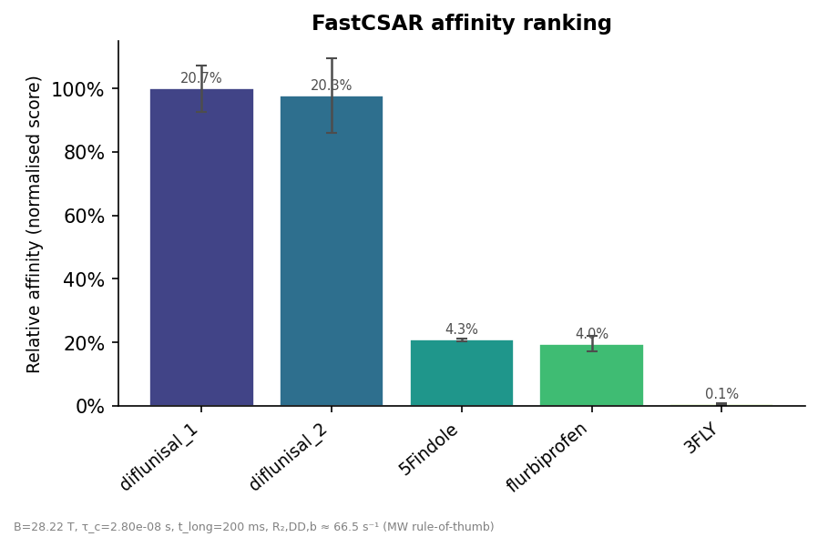

| Rank | Compound | Score | p_b (%) | ± (%) |
|---|---|---|---|---|
| 1 | diflunisal_1 | 1.0000 | 20.71 | 7.25 |
| 2 | diflunisal_2 | 0.9779 | 20.25 | 11.87 |
| 3 | 5Findole | 0.2074 | 4.30 | 0.48 |
| 4 | flurbiprofen | 0.1948 | 4.04 | 2.43 |
| 5 | 3FLY | 0.0055 | 0.11 | 0.31 |

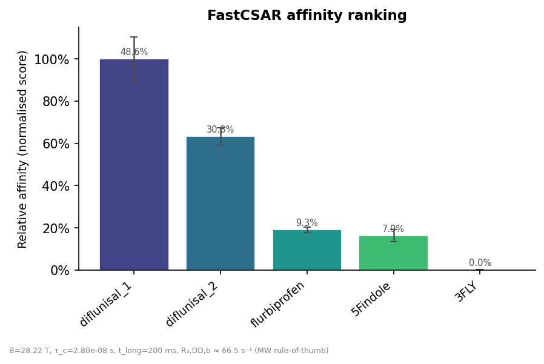

| Rank | Compound | Score | p_b (%) | ± (%) |
|---|---|---|---|---|
| 1 | diflunisal_1 | 1.0000 | 48.65 | 10.50 |
| 2 | diflunisal_2 | 0.6323 | 30.76 | 4.18 |
| 3 | flurbiprofen | 0.1902 | 9.25 | 1.27 |
| 4 | 5Findole | 0.1620 | 7.88 | 2.86 |
| 5 | 3FLY | 0.0008 | 0.04 | 0.10 |

**BSA, 14.11 T**

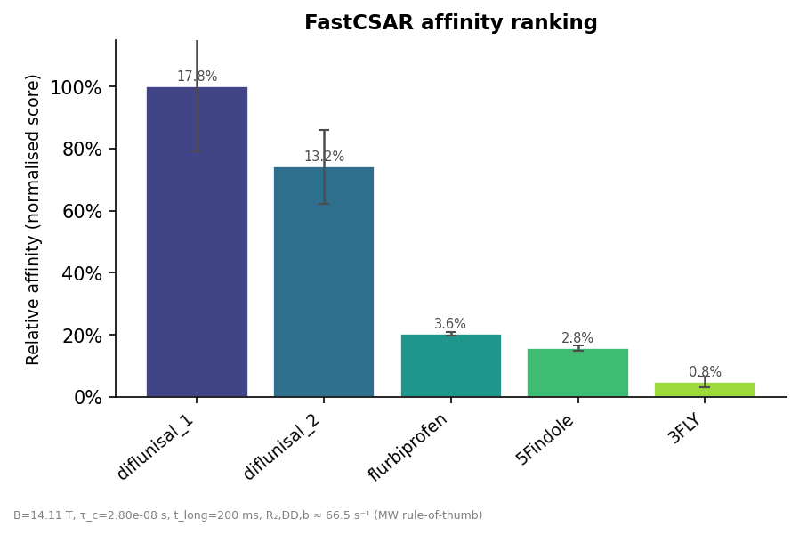

| Rank | Compound | Score | p_b (%) | ± (%) |
|---|---|---|---|---|
| 1 | diflunisal_1 | 1.0000 | 17.81 | 20.74 |
| 2 | diflunisal_2 | 0.7419 | 13.21 | 11.86 |
| 3 | flurbiprofen | 0.2026 | 3.61 | 0.66 |
| 4 | 5Findole | 0.1568 | 2.79 | 0.83 |
| 5 | 3FLY | 0.0477 | 0.85 | 1.83 |

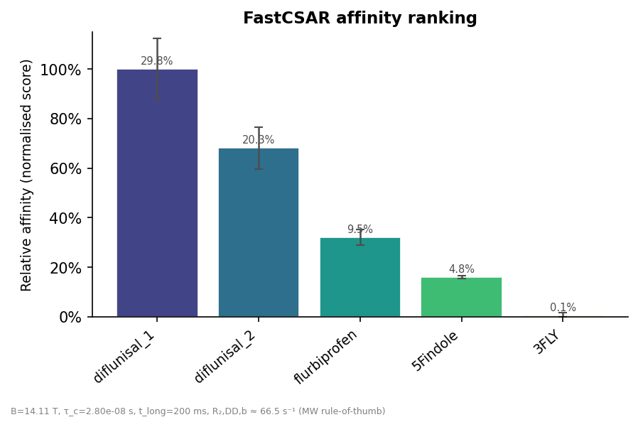

| Rank | Compound | Score | p_b (%) | ± (%) |
|---|---|---|---|---|
| 1 | diflunisal_1 | 1.0000 | 29.84 | 12.30 |
| 2 | diflunisal_2 | 0.6815 | 20.34 | 8.51 |
| 3 | flurbiprofen | 0.3200 | 9.55 | 3.17 |
| 4 | 5Findole | 0.1597 | 4.77 | 0.66 |
| 5 | 3FLY | 0.0036 | 0.11 | 1.21 |


| Rank | Compound | Score | p_b (%) | ± (%) |
|---|---|---|---|---|
| 1 | diflunisal_1 | 1.0000 | 174.81 | 10.50 |
| 2 | diflunisal_2 | 0.6522 | 114.01 | 4.31 |
| 3 | flurbiprofen | 0.2082 | 36.39 | 1.39 |
| 4 | 5Findole | 0.1564 | 27.34 | 2.76 |
| 5 | 3FLY | 0.0009 | 0.15 | 0.10 |

**diflunisal_1 wins every single one of the 13 runs above** — the most
stable result of any workflow in this report; unlike titration/CSAR,
neither protein, field, nor concentration flips the top hit here.

**Is 28.22 T better than 14.11 T?** Not in the sense of "gives a bigger
p_b" — several 14.11 T runs actually report *larger* p_b than their
28.22 T counterpart at the same concentration (e.g. TTR/50 µM: 47.27% at
14.11 T vs 28.42% at 28.22 T). But raw p_b magnitude isn't what the
ranking uses — the **relative separation between compounds** is, and
that's where 28.22 T wins clearly: at TTR/50 µM, 28.22 T separates the
best (diflunisal_1) from the worst (3FLY) by a factor of ~175× in score,
versus only ~45× at 14.11 T. More tellingly, **the 14.11 T/BSA/50 µM run
reports p_b = 174.8%** — a physically impossible bound fraction. That's
the simplified FastCSAR math (which assumes p_b ≪ 1) breaking down when
the raw signal decay is large at low field combined with a big protein,
not a real result. So: yes, the higher field is the more trustworthy
choice here, but judge that from whether p_b stays physically sensible
and how well-separated the ranking is — not from the p_b value alone.

**`fastcsar13_R2.toml` vs. `fastcsar80_R2.toml`** — same R2 data, same
five compounds, but CSA parameters (`delta_sigma`, `eta`) computed
differently between the two ORCA outputs (e.g. diflunisal_1:
δσ = −67.71 ppm / η = −0.963 vs. −68.14 ppm / η = −0.967):

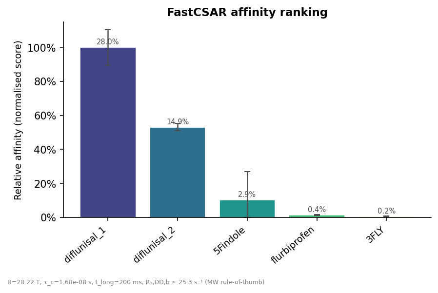

| Rank | Compound | Score | p_b (%) | ± (%) |
|---|---|---|---|---|
| 1 | diflunisal_1 | 1.0000 | 28.02 | 10.40 |
| 2 | diflunisal_2 | 0.5312 | 14.88 | 2.06 |
| 3 | 5Findole | 0.1032 | 2.89 | 16.56 |
| 4 | flurbiprofen | 0.0131 | 0.37 | 0.22 |
| 5 | 3FLY | 0.0058 | 0.16 | 0.32 |

The resulting ranking is nearly identical to `fastcsar13_R2.toml`'s
(diflunisal_1 → diflunisal_2 → 5Findole → flurbiprofen → 3FLY in both,
with p_b within ~1% of each other for every compound), so for this
dataset the ranking is not very sensitive to which of the two CSA
estimates is used.

<!-- TODO: describe what actually differs between the "13" and "80"
     ORCA calculations that produce fastcsar13_R2.toml's vs.
     fastcsar80_R2.toml's delta_sigma/eta (method, basis set, geometry,
     solvent model, etc.), and why one might be preferred over the
     other. -->
